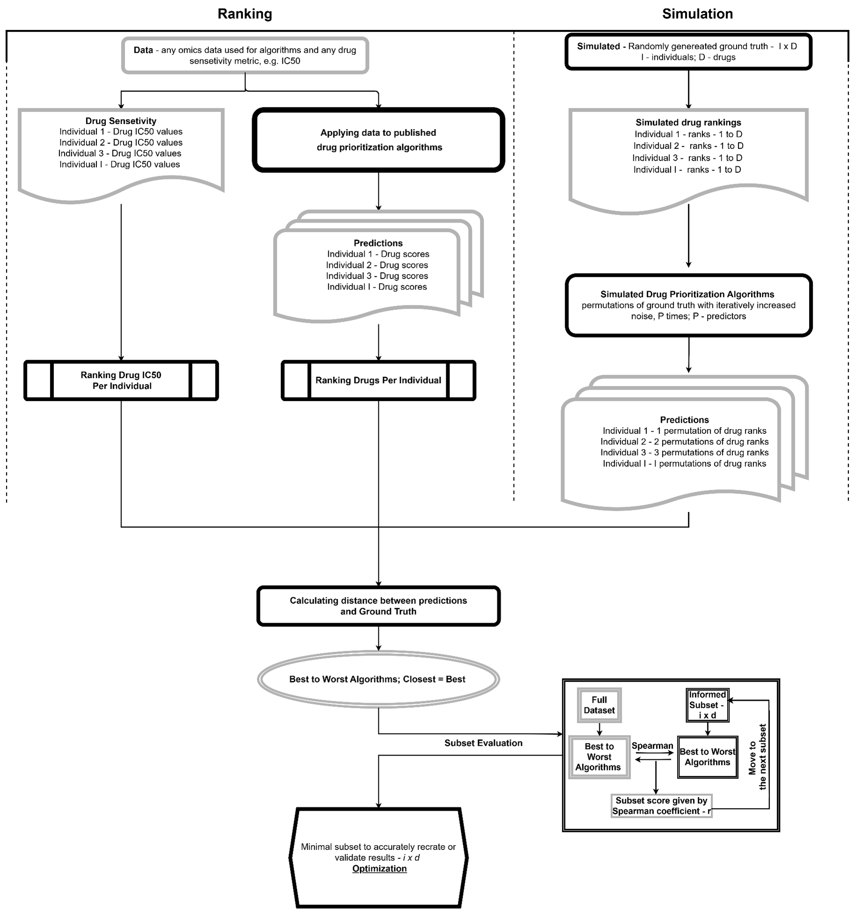
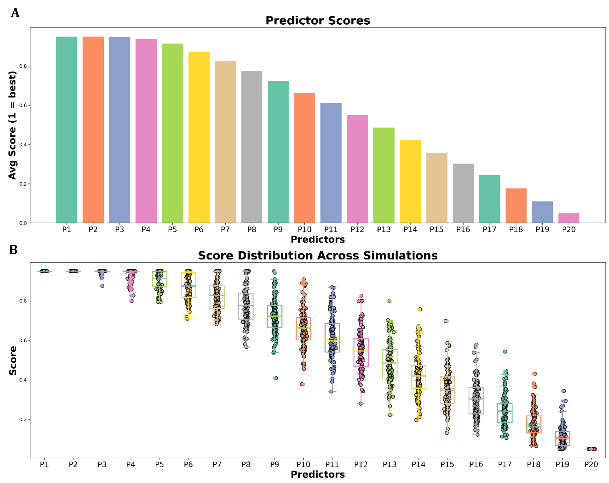
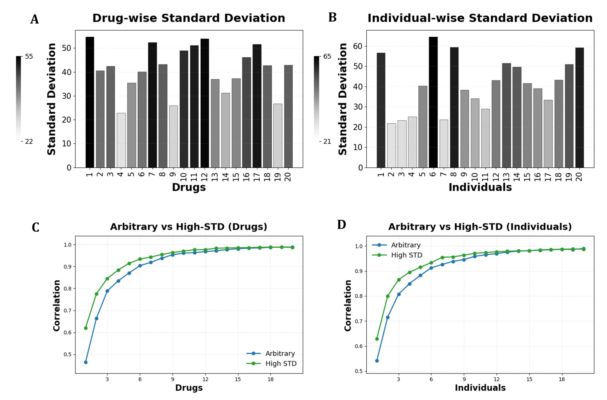
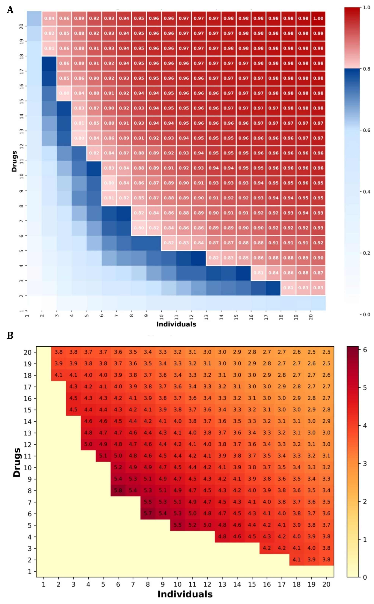
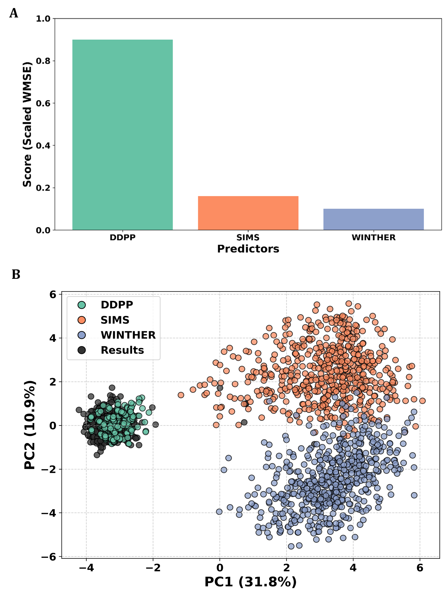

# **OptiRanker: A Framework for Optimizing Pre-Clinical Drug Prioritization**

## **Overview**
OptiRanker is a Python-based tool designed to simulate and optimize clinical trials for drug prioritization algorithms. By identifying the smallest subsets of drugs and individuals required to differentiate between algorithms, OptiRanker minimizes experimental costs while maximizing statistical power.

### **Key Features**
- Simulate the ranking process of drugs and predictors with varying levels of noise.
- Optimize subsets of drugs and individuals to reproduce accurate algorithm rankings.
- Evaluate and compare the robustness of WINTHER, SIMS, and DDPP drug prioritization algorithms as an examples In-Silico trial and pre-clinical trial optimization.
- Visualize results with detailed heatmaps, PCA plots, and statistical analyses.

---

## **Applications**
- **Simulated Trial Optimization**: Reduce experimental costs for clinical trials of drug prioritization algorithms.
- **Empirical Evaluation**: Analyze accuracy decay in noisy predictors.
- **Real-World Validation**: Use your own data to compare with algorithm predictions. Leverage CCLE datasets for IC50 predictions and evaluate tested rankings against WINTHER, SIMS, and DDPP using files in the In-Silico Sample Trial folder

---

## **Technical Details**

### **Languages and Libraries**
- **Core Language**: Python (version 3.8+)
- **Libraries**: NumPy, Pandas, Scikit-learn, Matplotlib, Seaborn, Plotly, Dash, PySimpleGUI

## **Installation**

### **1. Clone the Repository**
```bash
git clone https://github.com/OhadLandau/OptiRanker.git
cd OptiRanker
```

### **2. Set Up a Virtual Environment**
```bash
python3 -m venv venv
source venv/bin/activate  # For Linux/Mac
venv\Scripts\activate     # For Windows
```

### **3. Install Required Libraries**
```bash
pip install -r requirements.txt
```

### **4. Download CCLE Dataset**
- If user wants to generate predictions from their algorithms and input them \for optimization, transcriptomics and IC50 datasets can be found from the official [CCLE website](https://depmap.org/portal/) and [GDSC website](https://www.cancerrxgene.org/).

---

## **Repository Structure**
```
OptiRanker/
│
├── data/                       # Place for CCLE datasets (IC50 values, transcriptomics)
├── scripts/
│   ├── FullSimulation.py       # Simulation-based pipeline
│   ├── InputData.py            # Real-world dataset-based pipeline
│   
│
├── results/                    # Results folder for outputs, heatmaps, etc.
├── README.md                   # Documentation
├── requirements.txt            # Dependencies list

```

---

## **Usage**

### **1. Full Simulation Pipeline**
This script generates predictors with varying levels of noise and evaluates algorithm rankings based on simulated data.

#### **User Inputs:**
- Number of iterations for simulations.
- Dimensions of the dataset: number of individuals, drugs, and predictors.
- Minimum correlation threshold for rankings.
- Acceptable correlation distance.

Run the script:
```bash
python scripts/FullSimulation.py
```

### **2. Real-World Dataset Pipeline**
This script processes user-provided predictions, evaluates algorithm performance against results, and visualizes rankings and optimization. If user has prediction with no results input varries, see below. 

#### **User Inputs:**
- Select predictor and results files via a graphical interface.
- Choose whether data is already ranked or needs preprocessing.
- Enter minimum correlation threshold and number of subsets to find.
- If no result file is available, user is prompted to select the amount of Individuals and Drugs for his trial, he will then recieve the most informative of each (highest standard deviation)

Run the script:
```bash
python scripts/InputData.py
```

---

## **Workflow**
1. **Simulate or Import Data**:
   - Full simulation: Generate randomized rankings for individuals and drugs.
   - Real-world input: Use CCLE data for predictions and IC50 comparisons.

2. **Noise Injection**:
   - Inject varying levels of noise into the rankings to simulate predictor variability.

3. **Subset Optimization**:
   - Identify the smallest subsets of drugs and individuals with high correlation to full dataset rankings.
   - Use standard deviation metrics to prioritize subsets.

4. **Algorithm Evaluation**:
   - Compare WINTHER, SIMS, and DDPP outputs against IC50 ground truth.

5. **Visualization**:
   - Generate heatmaps, boxplots, and PCA plots to summarize results.

---

## **Example Outputs**
Below are sample outputs from OptiRanker. Click any image for full resolution:

<div style="display: flex; flex-wrap: wrap; gap: 10px;">
    <a href="results/Figure1.png" target="_blank"></a>
    <a href="results/Figure2.png" target="_blank"></a>
    <a href="results/Figure3.png" target="_blank"></a>
    <a href="results/Figure4.png" target="_blank"></a>
    <a href="results/Figure5.png" target="_blank"></a>
</div>

---

### **Reference**
See full work:  
**OptiRanker: An Open-Access Tool for Optimization of In Vivo Trials and Ranking of Drug Prioritization Algorithms**  
Ohad Landau, Kartheeswaran Thangathurai, Shai Magidi, Angel Porgador, Eitan Rubin

---

## **In-Silico Sample Trial**
The repository includes a folder named `In-Silico Sample Trial`, containing the following subfolders:
- **DDPP**: Results for DDPP algorithm.
- **WIN**: Results for WIN algorithm.
- **SIMS**: Results for SIMS algorithm.
- **ResultsCCLE**: CCLE IC50 ground truth results.

These folders allow users to recreate the results found in the paper and provide a sample in-silico trial to explore.

---

## **Contributing**

### **Development Setup**
```bash
# Install development dependencies
pip install -r requirements-dev.txt
```

---
